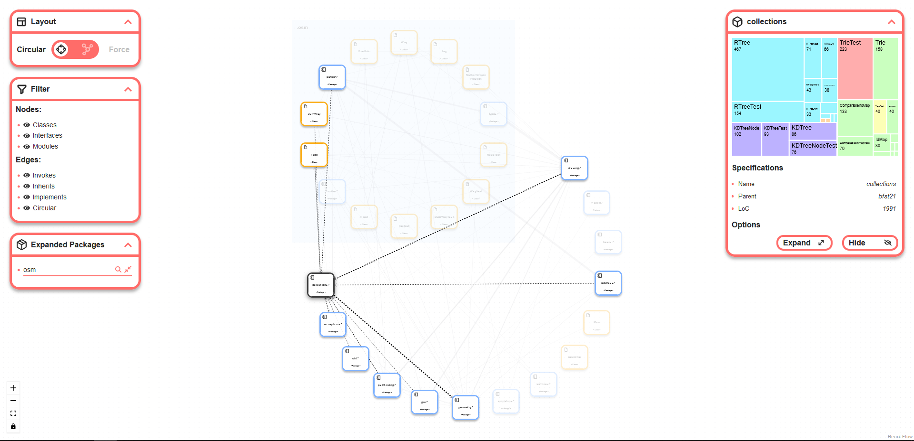
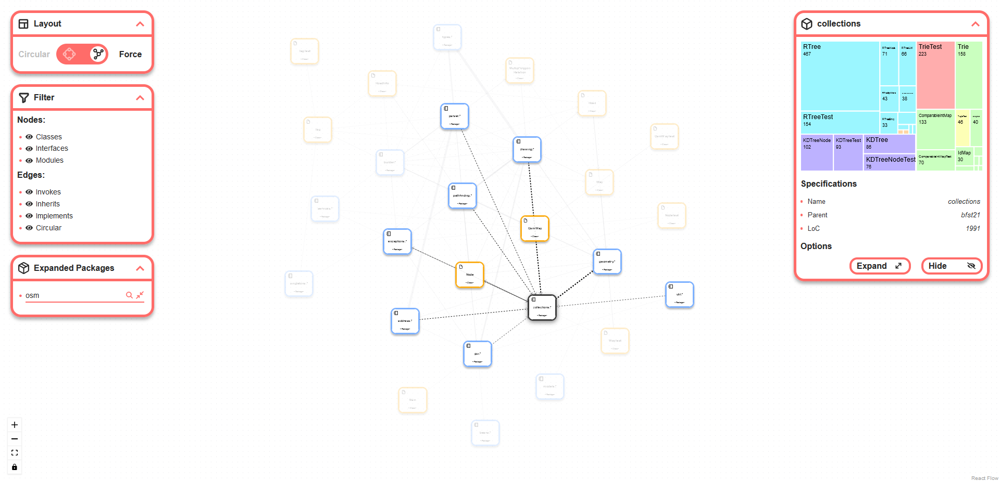

# Untangle
Untangle is a visualization tool for analyzing Java projects and its internal dependencies.  
It features no ads, tracking, cloud, server or data mining.

**Untangle is part of a research study - please fill out our [short survey](https://docs.google.com/forms/d/e/1FAIpQLSdklKw3WTpTMkxsHGbBROVpRa4UMqqKAwNolv2vco42i0Tv8Q/viewform) after trying out the tool. Thank you!**

## Untangle Capabilities
* View your project in either the *Circular* or *Force-directed* layouts.
* **Expand** and **collapse** packages to gain better insight into your project structure.
* **Highlight** edges pertaining to specific class / interface / package in your system by selecting nodes.
* Control your view with **filtering** and **hiding** of unneeded elements.

## Example of Circular Layout


## Example of Force-directed Layout


## Running the app
There is currently 2 different ways to run the app. You can either run it [locally](#running-untangle-locally) or through [docker](#running-untangle-in-docker-recommended). How to run the app is described in later sections.

It is important to note the time it can take for the application to start. If you are creating the docker image for the first time this step usually takes around 5 minutes depending on the power of your pc.
And the codeql analysis for the first time can also take up to 5 minutes depending on the size of your project.
However after having installed the docker image or ran the application once, you can refer to the [Rerunning the app](#rerunning-the-app)

### Running Untangle in Docker *(recommended)*

#### Prerequisites for running Untangle in Docker.
* A buildable maven or gradle Java project.
* Your project must be buildable with JDK 8, 11, 12, 13, 14, 15, or 16.
* [Docker](https://docs.docker.com/get-docker/) installed.


#### Step-by-step guide

First you must open a terminal and go to the project you wish to analyze with the command
```
cd ${project-to-analyze}
```
then find your OS type underneath and following the instructions
##### Unix users
Unix users can use the following command to run the app through docker
```
curl https://raw.githubusercontent.com/Markusgp/Untangle/main/untangle.sh | bash -s -- ${java-version}
```
where `${java-version}` is a JDK version that your project is buildable with

For example if you wanna run the application with java 15 the command would be
```
curl https://raw.githubusercontent.com/Markusgp/Untangle/main/untangle.sh | bash -s -- 15
```
##### Windows users
Windows users have to use **powershell with administration** rights and first allow the shell to run scripts with the following command
```
PowerShell -ExecutionPolicy Bypass
```
which will allow for you to run scripts in the current session

Next you have to set the environment variable `UNTANGLE_JAVA` to a JDK version that your project is buildable with, which can be done using the following command
```
$Env:UNTANGLE_JAVA = '${java-version}'
```
Now you can run the run script with the following command
```
(New-Object System.Net.WebClient).DownloadString("https://raw.githubusercontent.com/Markusgp/Untangle/main/untangle.ps1") | powershell
```

An example of running the app through docker with java version 15 this is the following commands that will be ran
```
PowerShell -ExecutionPolicy Bypass
$Env:UNTANGLE_JAVA = '15'
(New-Object System.Net.WebClient).DownloadString("https://raw.githubusercontent.com/Markusgp/Untangle/main/untangle.ps1") | powershell
```

After the application is up and running, you can open it on `localhost:8080`

### Running Untangle locally

#### Prerequisites for running Untangle locally.
* A buildable maven or gradle Java project.
* Version (16.0+) of [npm](https://docs.npmjs.com/downloading-and-installing-node-js-and-npm) installed.
* [CodeQL CLI](https://codeql.github.com/docs/codeql-cli/getting-started-with-the-codeql-cli/) installed.
* Your Java project must be buildable on your local machine.
* Git to clone the project

#### Step-by-step guide
First you have to clone the project

Then to run the app locally you can execute the ``run.sh`` script with some parameters:

```
./run.sh ${language} ${path-to-project}
```

1. `${language}` must be specified to `java`, as it is, for now, the only supported language.
2. `${path-to-project}` must be set to the path to the project that you want to analyze with Untangle.

### Rerunning the app
If you have already done an analysis on the project, and you wish to see the same data, you do not need to run the whole analysis again.

If you ran the application locally, you can simply use the `npm start` command and the application with the previous data should be displayed.

If you ran the application in docker, you need to run `docker exec untangled /bin/bash -c "cd react-app; npm start"`

### Note
If you are running the app locally these are the files/directories that will go in your source project
- qlpack.yml (codeql dependencies)
- codeql (codeql queries)
- codeql-database-java (the codeql database)

It is also worth to note that if something goes wrong, you might see some previous data from a prior execution, or the test data provided by us. Therefore, it is a good practice if you wish to run analysis on another project or an updated project, that you delete the contents of `src/codeql-data` to not get any mix-ups

## Contact
If there is any problems with the tool or you have any questions regarding the tool feel free to reach us on any of these emails
- guch@itu.dk
- kabm@itu.dk
- mgrp@itu.dk
- dlli@itu.dk
